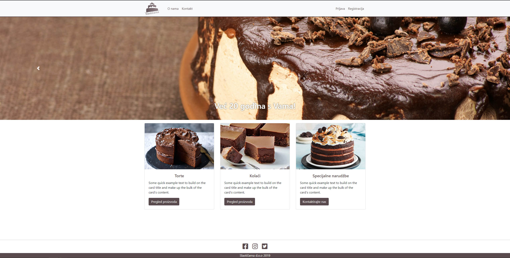
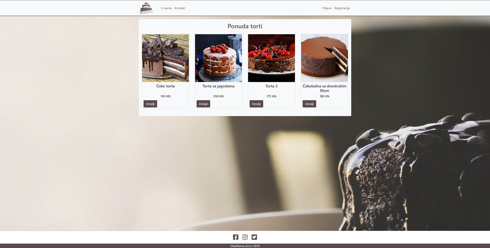
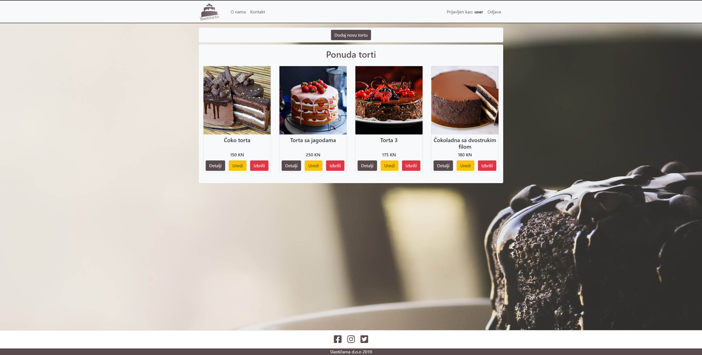
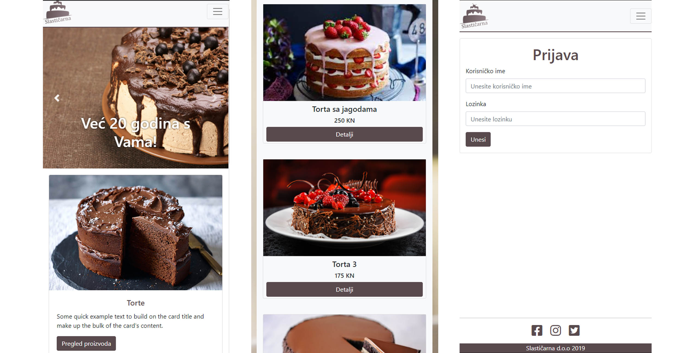

# Slasticarna 

A simple project made with express(node.js),ejs and bootstrap. It implements CRUD, so user can simply add, delete and update entries if logged in. Created with no SQL database - mongodb.

## How to run?

* simply npm install
* run mongodb (project will automatically create database if one does not exist)
* start server with npm start or nodemon
* open localhost:3000

Dependencies: 

    "body-parser": "^1.19.0",
    "ejs": "^2.7.4",
    "express": "^4.17.1",
    "express-session": "^1.17.0",
    "method-override": "^3.0.0",
    "mongoose": "^5.7.11",
    "node-session": "^1.2.1",
    "passport": "^0.4.0",
    "passport-local": "^1.0.0",
    "passport-local-mongoose": "^5.0.1"
